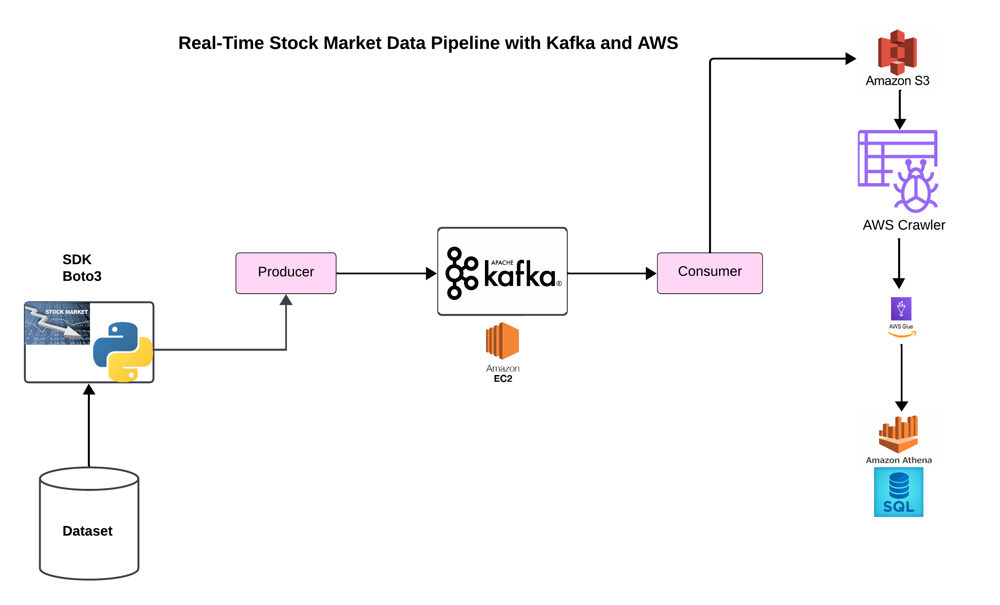

# Real-Time Stock Market Data Pipeline with Kafka and AWS

## Project Overview

This project processes real-time stock market data using Apache Kafka for streaming and various AWS services for data storage, cataloging, and querying. The architecture ensures a robust and scalable solution for real-time data ingestion, processing, and analysis.

## Architecture

1. **Data Ingestion**: Stock market data is ingested using Python scripts with the Boto3 SDK.
2. **Producer**: The ingested data is fed into a Kafka producer.
3. **Kafka Streaming**: The data streams through an Apache Kafka cluster hosted on Amazon EC2.
4. **Consumer**: A Kafka consumer retrieves the data from the Kafka cluster.
5. **Data Storage**: The consumer pushes the data into Amazon S3 for storage.
6. **Data Cataloging**: An AWS Glue Crawler catalogs the data stored in S3.
7. **Data Processing and Querying**: AWS Glue processes the cataloged data, and Amazon Athena allows querying the data using SQL.

## Features

- Real-time data ingestion and streaming
- Scalable and robust architecture
- Efficient data storage and cataloging
- Easy querying and data analysis with SQL

## Technologies Used

- **Apache Kafka**: For real-time data streaming.
- **Amazon EC2**: Hosting the Kafka cluster.
- **Amazon S3**: Storage for ingested data.
- **AWS Glue**: Data cataloging and ETL.
- **Amazon Athena**: Querying data using SQL.
- **Python**: Scripting and data ingestion.
- **Boto3 SDK**: Interface with AWS services.

## Getting Started

### Prerequisites

- Python 3.x
- AWS Account
- Kafka Cluster
- Required Python Libraries: `boto3`, `kafka-python`

## Usage

- **Producer**: Ingests real-time stock market data and sends it to the Kafka topic.
- **Consumer**: Reads data from the Kafka topic and stores it in Amazon S3.
- **AWS Glue Crawler**: Catalogs the data stored in S3.
- **Amazon Athena**: Allows querying the data using SQL.

## Contributing

Contributions are welcome! Please open an issue or submit a pull request for any improvements or new features.

## Acknowledgements

- [Apache Kafka](https://kafka.apache.org/)
- [Amazon Web Services](https://aws.amazon.com/)
- [Python](https://www.python.org/)
